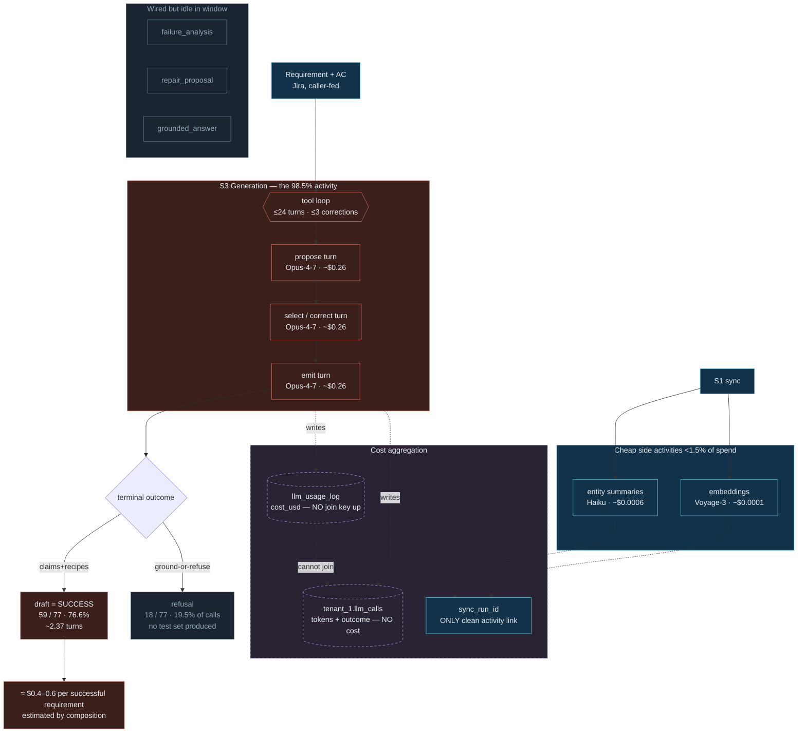

# Plimsol — LLM Usage & Cost per Completed Product Activity

**Status:** Reconnaissance + telemetry analysis. Companion to
[`PLIMSOL_SYSTEM_ARCHITECTURE.md`](PLIMSOL_SYSTEM_ARCHITECTURE.md). Derived from
repository code and **live `llm_usage_log` telemetry** as of 2026-07-04.
Documentation-only — no code, prompt, model config, schema, or pricing was
changed.

> **Reading the numbers.** Every figure is tagged:
> **[M] measured** (read directly from the database),
> **[C] estimated-by-composition** (exact sub-measurements combined, stated
> method), **[P] price-unverified** (uses `pricing.py`'s stored rates, which for
> the 4.5/4.6/4.7/5-era models are post-cutoff and **must be externally
> validated** before trusting absolute dollars — the token counts underneath are
> real regardless).

---

## 0. Telemetry window (the sample)

**[M]** All figures below come from one tenant (`tenant_1`, the env-59 dogfood
org), **2026-06-13 → 2026-07-04** (≈3 weeks):

| Metric | Value |
|---|---|
| Total `llm_usage_log` rows | 323 |
| Status split | 321 `ok` · 1 `provider_error` · 1 `auth_error` |
| Total recorded cost | **$21.4439** |
| Tenants | 1 |

This is a **development / dogfood** sample, not production traffic. Averages are
usable; activity-level P50/P95 are **not** reliably computable (see §4, §7).

---

## 1. LLM Usage Map — where Plimsol calls an LLM

Every LLM path routes through the single gateway
(`primeqa/intelligence/llm/gateway.py`) via two entry points — `llm_call()`
(general) and `tool_turn()` (S3 generation) — except embeddings (Voyage, still
logged) and one legacy raw-SDK fallback (not logged). Deterministic substrates
(S6 interpretation, S7 retrieval, the GO/NO-GO decision engine) make **no** LLM
calls.

```
Requirement (Jira)
   │
   ▼
[S3 GENERATION] ─ task 'generation' ─ Opus-4-7 ─ tool loop (≤24 turns/req) ──► claims + recipes   ◄── 98.5% of spend
   │
S1 sync ─► [ENTITY SUMMARY] ─ 'entity_summary_flow' / '_validation_rule' ─► plain-English blurbs
   │        [EMBEDDINGS]      ─ Voyage-3 ────────────────────────────────────► entity vectors
   │
Run fails ─► [FAILURE DIAGNOSIS] ─ 'failure_analysis' ──► cause prose      (idle in window)
   │         [REPAIR PROPOSAL]   ─ 'repair_proposal' ───► recipe-edit diff (idle in window)
   │
/ask ─────► [CONVERSATION PHRASING] ─ 'grounded_answer_generation' ───► answer prose (idle in window)
```

**[M]** Only **five** task tags actually produced spend in the window:

| Task tag | Calls | Total $ | % of spend | Avg $/call | Model |
|---|--:|--:|--:|--:|---|
| `generation` | 86 | **$21.1321** | **98.5%** | $0.2457 | Opus-4-7 (80), Sonnet-5 (6) |
| `generation_live_eval` | 34 | $0.2612 | 1.2% | $0.0077 | Sonnet-5 (heavy cache) |
| `entity_summary_validation_rule` | 54 | $0.0298 | 0.1% | $0.0006 | Haiku-class |
| `embedding_generation` | 130 | $0.0129 | 0.06% | $0.0001 | Voyage-3 |
| `entity_summary_flow` | 17 | $0.0079 | 0.04% | $0.0005 | Haiku-class |

**Wired but idle in this window** (code exists, zero rows): `failure_analysis`,
`repair_proposal`, `grounded_answer_generation`, `interpretation_phrasing_generation`,
`connection_test`. Diagnosis/interpretation being idle is expected — **S6 is
deterministic**; only an optional, currently-unwired phrasing enricher would add
LLM cost there.

---

## 2. LLM Call-Site Inventory

| # | Activity | Call site | Trigger | Task | Sync/Async | Loop | Retry | Fallback/Escalation | Cache | Telemetry |
|---|---|---|---|---|---|---|---|---|---|---|
| 1 | **Requirement→test generation** | `generation/runtime.py:434` → `gateway.tool_turn` (`gateway_binding.py:38`) | Worker S3 tick (`generation/consumer.py`) | `generation` | Async | **Yes** — `while` loop, `DEFAULT_MAX_TURNS=24`, `DEFAULT_MAX_CORRECTIONS=3` | provider backoff (429/529×3, timeout/net×1), 1 row/turn | model pinned via `model_override`, **no escalation** | ephemeral on grammar+tools | `llm_usage_log` **+** separate `tenant_1.llm_calls` ledger |
| 2 | Live eval | `intelligence/llm/eval/runner.py:191` `llm_call` | CLI/test | `generation_live_eval` | — | per-fixture | gateway backoff | none | heavy (7.5k cached avg) | logged |
| 3 | Entity summary (VR) | `worker.py:579` `llm_call` | Worker enrichment tick | `entity_summary_validation_rule` | Async | one/row | gateway backoff | none | none | logged, `sync_run_id` |
| 4 | Entity summary (Flow) | `worker.py:579` `llm_call` | Worker enrichment tick | `entity_summary_flow` | Async | one/row | gateway backoff | none | none | logged, `sync_run_id` |
| 5 | Org-model embeddings | `worker.py:398` → Voyage (`embeddings.py`) | Worker enrichment tick | `embedding_generation` | Async | one/batch | provider | none | n/a | logged, `sync_run_id` |
| 6 | Conversation `/ask` | `conversation_bridge.py:77` `llm_call` | `/ask` route | `grounded_answer_generation` | Sync | no | gateway backoff | routed chain | per-tenant | logged (idle) |
| 7 | Repair proposal | `intelligence/repair_agent.py:205` `llm_call` | Scheduler triage tick | `repair_proposal` | Async | attempt-capped | gateway backoff | routed chain | per-tenant | logged (idle) |
| 8 | Failure diagnosis | `intelligence/service.py:266` `llm_call` | S6/exec failure path | `failure_analysis` | Sync | no | gateway backoff | routed chain | per-tenant | logged (idle) |
| 8b | Diagnosis (legacy) | `intelligence/service.py:299` raw `messages.create` | only w/o tenant+key | — | Sync | no | SDK | none | none | **NOT logged (invisible)** |
| 9 | Interpretation phrasing | `intelligence/interpretation_phrasing.py:61` `llm_call` | `get_or_phrase` | `interpretation_phrasing_generation` | Async | no | gateway backoff | routed chain | per-tenant | logged (**no live caller**) |

**[M] Escalation across the whole window = 0** for every task — no low-confidence
second-model hops occurred. Generation pins its model once per batch and never
escalates; the multi-call amplification is entirely the **tool loop within one
attempt**, not gateway retries or escalation.

---

## 3. Activity Cost Model

The hierarchy the repo actually supports:

```
Product Activity  (one requirement fully generated)
   └─ Job / Attempt   tenant_1.s3_generation_jobs (attempt_count) → generation_requests
        └─ LLM Calls   tenant_1.llm_calls  (2.37 per successful outcome)   [tokens, NO cost]
             └─ Token Usage   token_count_input / output
                  └─ Cost      llm_usage_log.cost_usd   [cost, but NO join key back up]
```

**The central correlation gap.** The cost-bearing table (`llm_usage_log`) and the
outcome-linked ledger (`tenant_1.llm_calls → generation_outcomes`) are **two
parallel records of the same calls with no shared id**. The S3 runtime calls
`gateway.tool_turn` without passing `context_for_log` / `requirement_id` /
`generation_outcome_id` (`generation/gateway_binding.py:38-42`), so every
`generation` usage row lands with `context = {}` and NULL correlation columns.
Consequences, measured:

- **[M]** Ledger `llm_calls`: **174** calls (span 2026-06-05→07-04). `llm_usage_log`
  `generation`: **86** rows (span 2026-06-15→07-04). The two **disagree on both
  count (174 vs 86) and average input tokens (~5.7k ledger vs ~11.9k usage-log)**.
  Part is the 10 earlier ledger days; part is that the cost table under-captures
  calls the ledger recorded. **Neither table alone gives an authoritative total
  generation spend.**
- **[M]** The ledger has exact tokens + terminal outcome but **no `cost_usd`
  column** — cost there must be recomputed from tokens × price.
- **[M]** `llm_usage_log` has exact `cost_usd` but cannot be attributed to a
  requirement, job, or outcome except heuristically (tenant + task + time window).

**One activity link IS clean: [M]** `sync_run_id` on `llm_usage_log` (migration
058) ties embedding + summary cost to an S1 sync run — **8 sync runs, 189 rows,
$0.049 total ≈ $0.006 / sync run**, exact.

---

## 4. Average Cost per Completed Activity

### 4.1 Generation — the one that matters (98.5% of spend)

**Per model turn [M][P]** (from `llm_usage_log`, cache-aware, real cost):

| Model | Turns | Avg $/turn | P50 | P95 | Max | Avg in tok | Avg out tok | Avg cached |
|---|--:|--:|--:|--:|--:|--:|--:|--:|
| Opus-4-7 | 80 | **$0.2600** | $0.2633 | $0.3486 | $0.3679 | 11,908 | 1,085 | 0 |
| Sonnet-5 | 6 | $0.0553 | $0.0437 | $0.0804 | $0.0808 | 2,625 | 2,048 | 7,659 |

> Opus generation turns show **0 cached tokens** — prompt caching is **not**
> reducing generation cost today (the dominant task pays full input rate every
> turn). Only the Sonnet-5 eval path benefits from the ephemeral cache.

**Terminal outcomes [M]** (from `tenant_1.generation_outcomes`, exact):

| Outcome | Count | Share |
|---|--:|--:|
| **draft (success)** | **59** | **76.6%** |
| refusal — structural-validation-failure | 7 | 9.1% |
| refusal — emission-deferred | 4 | 5.2% |
| refusal — ambiguous-reference | 3 | 3.9% |
| refusal — ungrounded-claim | 2 | 2.6% |
| refusal — no-relevant-context | 1 | 1.3% |
| refusal — no-admissible-negative-scenario-found | 1 | 1.3% |
| **Total** | **77** | |

**Turns per outcome [M]** (from `tenant_1.llm_calls`, exact): draft **2.37**,
refusal 1.89, overall 2.26.

**Headline — cost per successfully completed requirement:**

> **[C][P] ≈ $0.62 per successful test-set generation**
> = 2.37 turns/draft (exact, ledger) × $0.26/Opus-turn (exact, usage-log).

**Alternative denominator (fully-loaded, within the logged window) [M][P]:**
$21.13 total generation spend ÷ 59 drafts = **$0.36 / successful requirement**
— this charges *all* generation spend (including refusals) to the successes but
uses only the 86 logged turns. The composed $0.62 and the loaded $0.36 differ
**because the two source tables disagree on call count** (§3). Treat the true
figure as **$0.4–0.6 per successful requirement, ±uncertainty from the join
gap**, not a single precise number.

**Activity-level P50/P95: unavailable.** Without a join key, per-requirement cost
cannot be distributed, only averaged. Per-*turn* percentiles (above) are the
finest exact tail data.

### 4.2 Everything else [M][P]

| Activity | Completed count | Avg calls | Avg cost | Notes |
|---|--:|--:|--:|---|
| Entity summary (VR) | 54 | 1 | $0.0006 | Haiku-class, one call each |
| Entity summary (Flow) | 17 | 1 | $0.0005 | Haiku-class |
| Embedding (per call) | 130 | 1 | $0.0001 | Voyage-3, cheapest + most frequent |
| **S1 sync (LLM portion)** | 8 runs | ~24 | **$0.006 / run** | exact via `sync_run_id` |
| Failure diagnosis | 0 | — | **$0 (deterministic)** | S6 has no LLM; `failure_analysis` idle |

---

## 5. Retry & Repair Cost Amplification

- **[M] Job-level retries: none.** `s3_generation_jobs.attempt_count` avg = **1.0**,
  max 1 (40 completed jobs). No job re-ran.
- **[C] In-attempt amplification is the real multiplier.** One successful
  requirement = **2.37 model calls** (propose → correct/select → emit), each
  billed. So the "activity cost" is ~2.4× a single call — exactly why *one LLM
  call ≠ one completed activity*.
- **[M][C] Refusal tax.** 34 of 174 generation calls (**19.5%**) ended in a
  terminal **refusal** that produced no test set. So **≈ 1 in 5 generation dollars
  buys a refusal, not a test.** (This is honest spend, not waste — ground-or-refuse
  is a designed outcome — but it belongs in unit economics.)
- **[M] Escalation/fallback amplification: $0.** Zero escalated calls in the
  window; generation never invokes a second model.
- **[M] Provider-retry amplification: invisible & ~0.** Network/429 retries are
  internal to `provider.invoke` and write one row; the 2 error rows in the window
  are recorded at **$0 cost** (they consumed input tokens that are **not**
  captured — a small under-report of true API billing).

---

## 6. LLM Economics Architecture Diagram



*(The main system diagrams in `PLIMSOL_SYSTEM_ARCHITECTURE.md` mark LLM call
boundaries at S3 generation, worker enrichment, and the idle diagnosis/repair/ask
paths — not a single generic "LLM" box.)*

---

## 7. Cost Hotspots & Telemetry Gaps

### A. Highest-cost activity — **[M]** Requirement→test generation, unambiguously:
**$21.13 = 98.5%** of all spend; **~$0.4–0.6 per successful requirement**. Nothing
else is within two orders of magnitude.

### B. Highest-frequency activity — **[M]** Embeddings (130 calls), then generation
turns (86) and VR summaries (54). But frequency ≠ cost: embeddings are the
**cheapest** ($0.0001) and generation the **dearest**.

### C. Retry amplification — **[M]** No job-level retries; **[C]** the in-attempt
tool loop is the 2.37× multiplier that turns "$0.26 a call" into "~$0.6 an
activity."

### D. Repair amplification — **[M][C]** The dominant amplifier is **refusals**:
**19.5% of generation calls** reach a terminal refusal (structural-validation,
ambiguous-reference, ungrounded, etc.) and produce no test set. The dedicated
`repair_proposal` agent was **idle** in this window ($0).

### E. Model mismatch — **[M] observation (not a recommendation):** Generation runs
on **Opus-4-7 ($15/$75)** — the single most expensive model — while every other
live activity uses Haiku-class or Voyage. The Sonnet-5 eval path did comparable
tool work at **$0.055/turn vs $0.26/turn** with heavy cache reuse. Whether Opus
is *required* for generation quality is out of scope here; the datum is only that
the 98.5%-of-spend task is on the top-tier model and pays **zero cache benefit**
(0 cached tokens on Opus turns) while a cheaper model on a similar shape did.

### F. Invisible cost — **[M]** Three sources:
1. **The dominant task is unattributable.** All `generation` rows carry empty
   `context` + NULL correlation columns → 98.5% of spend cannot be tied to a
   requirement/job/outcome except by heuristic time-window join. *This is the most
   important gap: unit economics for the core product activity rests on a
   heuristic, not a key.*
2. **Two records disagree** (174 ledger vs 86 usage-log calls; 2× input-token
   gap) → no authoritative total generation spend.
3. **Error rows are $0** despite burning input tokens; the legacy raw-SDK
   fallback (`intelligence/service.py:299`) bypasses logging entirely.

**Observations vs. recommendations are kept separate:** everything above is an
observation. The single, low-risk, code-change-free thing worth noting for a
future session (not done here) is that the gateway *already accepts*
`context_for_log`; plumbing a `generation_outcome_id` through
`build_tool_turn_fn` would close gap F.1 — but that is a code change and out of
scope for this documentation task.

---

## 8. Product Economics Summary (for leadership)

All figures **[M]easured tokens × [P]rice-unverified rates**; the generation
per-activity figures are **[C]omposed** because the cost table doesn't join to
outcomes. Sample = 1 dogfood tenant, 3 weeks, 59 successful requirements.

| Question | Answer | Basis |
|---|---|---|
| Cost to process **one requirement** (successful) | **≈ $0.4–0.6** | [C] 2.37 turns × $0.26 / loaded $21.13÷59 |
| Cost to generate **one successful test set** | same activity as above | [C] |
| Cost per **generated claim** | **≈ $0.16–0.28** | [C] 59 drafts → 129 claims (2.19/req); $0.62/req ÷ 2.19, or $21.13÷129 |
| Cost per **executable recipe** | **≈ $0.22–0.39** | [C] 59 drafts → 95 recipes (1.61/req) |
| **Diagnosis** cost per completed run | **$0** | [M] S6 is deterministic; no LLM diagnosis live |
| % of LLM spend from **retries** | **~0% job-retry**; ~2.4× in-attempt loop | [M]/[C] |
| % of generation spend on **refusals** | **~19.5%** (≈1 in 5) | [M] call-share |
| % of spend on **all non-generation** activity | **1.5%** | [M] |

**Denominator honesty.** "Cost per claim" above is **not** total spend ÷ all
89 stored `test_claims` (26 of which are deprecated and some pre-date this
window). It is spend attributed to the **59 successful generation activities in
the sample** ÷ the **129 claims those activities wrote**. Different denominators
(all stored claims, approved-only, per-tenant-lifetime) give different numbers;
this doc uses **claims-written-by-sampled-successful-activities** and says so.

**Activities with insufficient telemetry for reliable costing:**
- **Generation per-requirement** — averageable, but no join key → no tails, and
  a 2× inter-table disagreement on totals. *Reliable to ±order-of-magnitude-half,
  not to the cent.*
- **Diagnosis / repair / conversation** — idle in the window; **no data at all**
  to cost them. If/when they run, they are logged (except the legacy fallback).

---

## Appendix — SQL methodology

All queries are read-only aggregates against the live Railway Postgres
(`llm_usage_log` in `public`; the S3 ledger in schema `tenant_1`). Representative
queries:

```sql
-- Spend by task (the 98.5% headline)
SELECT task, count(*) n,
       round(avg(input_tokens)) avg_in, round(avg(output_tokens)) avg_out,
       round(sum(cost_usd),4) sum_usd, round(avg(cost_usd),5) avg_usd
FROM llm_usage_log WHERE status='ok' GROUP BY task ORDER BY sum_usd DESC;

-- Generation per-turn distribution by model
SELECT model, count(*) n, sum(escalated::int) esc,
       round(avg(cost_usd),4) avg_usd,
       round(percentile_cont(0.5) WITHIN GROUP (ORDER BY cost_usd)::numeric,4) p50,
       round(percentile_cont(0.95) WITHIN GROUP (ORDER BY cost_usd)::numeric,4) p95
FROM llm_usage_log WHERE task='generation' AND status='ok' GROUP BY model;

-- Terminal outcomes (success vs refusal) — the completed-activity denominator
SELECT outcome_kind, refusal_kind, count(*)
FROM tenant_1.generation_outcomes GROUP BY 1,2 ORDER BY 3 DESC;

-- Turns per outcome (the in-attempt amplifier) — from the ledger
SELECT o.outcome_kind, count(DISTINCT o.outcome_id) outcomes, count(c.call_id) calls,
       round(count(c.call_id)::numeric / nullif(count(DISTINCT o.outcome_id),0),2) calls_per
FROM tenant_1.generation_outcomes o
LEFT JOIN tenant_1.llm_calls c ON c.generation_outcome_id = o.outcome_id
GROUP BY o.outcome_kind;

-- Claims/recipes written by successful activities (per-unit denominators)
SELECT count(*) drafts,
       sum(jsonb_array_length(coalesce(claims_written,'[]'::jsonb)))  total_claims,
       sum(jsonb_array_length(coalesce(recipes_written,'[]'::jsonb))) total_recipes
FROM tenant_1.generation_outcomes WHERE outcome_kind='draft';

-- S1 sync LLM cost — the ONE clean activity attribution
SELECT count(DISTINCT sync_run_id) runs, count(*) rows, round(sum(cost_usd),4) usd
FROM llm_usage_log WHERE sync_run_id IS NOT NULL;
```

### Pricing reference (from `pricing.py`, USD per 1M tokens, dated 2026-04-19)

**[P] — the 4.5/4.6/4.7/5-era rows are post-cutoff and must be externally
validated.** Cache-read = 0.10× input, cache-write = 1.25× input (derived).
Voyage-3 = $0.06/1M (in `embeddings.py`). Unknown model → Sonnet-4 fallback rate.

| Model | Input | Output |
|---|--:|--:|
| claude-opus-4-7 *(drives 98% of spend)* | 15.00 | 75.00 |
| claude-sonnet-5 | 3.00 | 15.00 |
| claude-haiku-4-5 | 1.00 | 5.00 |
| claude-3-5-haiku | 0.80 | 4.00 |
| (opus 4.x = 15/75 · sonnet 4.x/3.x = 3/15) | | |

### Source files

`intelligence/llm/gateway.py`, `pricing.py`, `usage.py`, `provider.py`,
`router.py`, `limits.py`, `tiers.py`, `embeddings.py`;
`generation/runtime.py`, `gateway_binding.py`, `consumer.py`;
`migrations/031_llm_usage_log.sql`, `058_llm_usage_log_sync_run_id.sql`;
`alembic/versions/tenant/20260520_0010_create_substrate_3_ledger.py`,
`20260525_0020_s3_generation_jobs.py`.

---

*Documentation-only analysis. No code, prompt, model configuration, pricing, or
schema was modified.*
