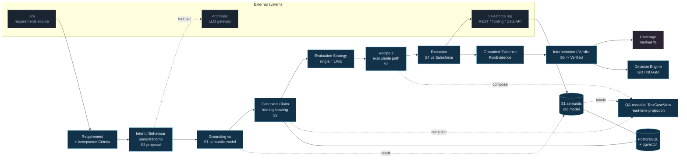
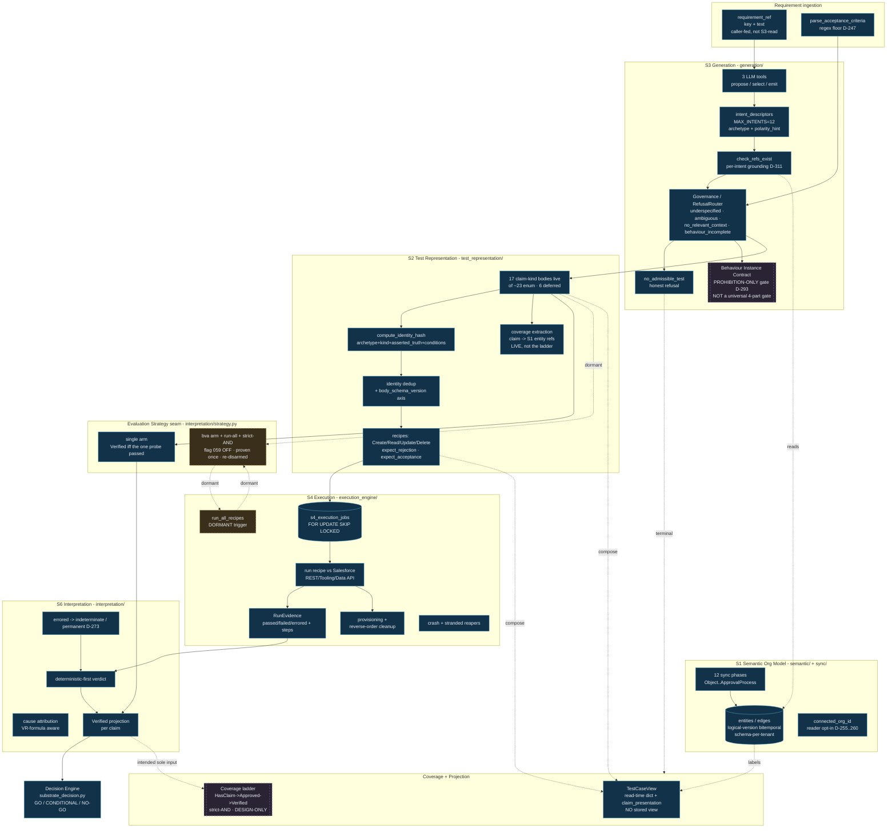

# Plimsol — System Architecture (Reconstructed)

**Status:** Reference reconstruction. Derived from repository code, migrations,
ADRs, `DECISIONS_LOG.md`, and tests as of 2026-07-04. This document is a
*read* of the system, not a design authority — where it disagrees with
`PLATFORM_VISION.md` (the authoritative substrate decomposition, per D-050) the
vision doc wins on decomposition; where it disagrees with `CLAUDE.md` on
*current runtime behaviour*, the code wins (§8 lists the discrepancies).

This is a documentation-only artifact. It makes no implementation decisions,
changes no schema, and resolves no open architectural questions — open seams are
surfaced (§7), not closed.

> **Companion:** LLM usage and cost-per-completed-activity economics — where the
> product spends on LLM calls and what one completed activity costs — live in
> [`PLIMSOL_LLM_ECONOMICS.md`](PLIMSOL_LLM_ECONOMICS.md) (§10 summarizes; the LLM
> call boundaries are annotated on the diagrams below).

---

## 1. Architecture scope

Plimsol is a Release Intelligence System for Salesforce. The core loop is:

> **Requirement → Intent/Proposal → Grounding → Claim → Evaluation Strategy →
> Recipe → Execution → Evidence → Interpretation/Verdict → Coverage →
> QA-readable Projection**

The engine is the eight-substrate decomposition (S1–S8). This reconstruction
covers the substrates that carry the requirement-to-verdict path (S1, S2, S3,
S4, S6), the two cross-cutting decision surfaces (the decision engine and the
LLM gateway), the coverage and projection layers, and the runtime/deployment
shape. S5 (knowledge), S7 (conversation) and S8 (evolution/grounding-validity)
are shown at their boundaries only.

The governing principle the diagrams preserve:

> **Identity defines the assertion. Execution gathers evidence. Interpretation
> decides whether the evidence satisfies the assertion. Projection makes the
> result understandable. Coverage reports what has actually been earned.**

---

## 2. Status legend

Every node in every diagram carries one of four statuses. This distinction is
the point of the document — dormant and design-only machinery is **not** drawn
as if it were live.

| Status | Meaning |
|---|---|
| **LIVE** | Runs in the default production path today; grounded in executing code. |
| **DORMANT** | Implemented and tested, but has no live effect by default (flag-off, or no trigger writes the state that activates it). |
| **DESIGN-ONLY** | Ratified in an ADR/spec/decision, but no corresponding runtime code exists. |
| **DEFERRED** | Explicitly parked, or enum/spec-reserved without an implementation. |

---

## 3. Architecture principles (as implemented)

1. **Identity is the assertion, not the test script.** A claim's identity hash
   is computed over exactly four canonicalized fields — `archetype`,
   `claim_kind`, `asserted_truth`, `semantic_conditions`
   (`test_representation/identity_hash.py:77`). It deliberately **excludes**
   `body_schema_version`, `test_id`, `version_seq`, and all recipe content.
   Recipes are operational; claims are canonical.
2. **Ground-or-refuse.** Honest refusal is a first-class generation outcome, not
   an error path. `GenerationOutcome` is a discriminated union (`draft |
   refusal`) with a typed `RefusalRouter` (`generation/governance_core.py:702`).
3. **Deterministic-first interpretation.** S6 decides verdicts from captured
   evidence; the `Verified` predicate is a pure, stdlib-only applier
   (`interpretation/strategy.py`) that never imports execution, persistence, or
   the decision engine (enforced by an AST purity-guard test).
4. **Projection is not truth.** The QA-readable "test case" view is composed at
   read time from the claim + recipe + S1 labels and is never persisted as an
   identity-bearing row (`intelligence/claim_presentation.py`,
   `intelligence/s3_generation_console.py`).
5. **Metadata inspection ≠ behavioural verification.** Configuration claims that
   only inspect metadata are a distinct depth from behavioural claims that
   create records and observe automation effects (`claim_depth()` in
   `claim_presentation.py`).
6. **Tenant/org isolation is structural.** S1 is schema-per-tenant with a
   runtime `CHECK (tenant_id = current_setting('app.tenant_id'))`; the per-org
   restructure (D-255…260) adds `connected_org_id` to the S1 spine.

---

## 4. Diagram 1 — Executive System Architecture

Audience: product / QA leadership, Salesforce architects, technical diligence.
The clean conceptual flow, external systems around the core, projection as a
branch. Dashed = not live.



> **Coverage is dashed** because the ladder (Has Claim → Approved → Verified) is
> ratified (D-270/D-271) but not built — see §5-E and §7. The `Verified`
> predicate it will consume **is** live, but it is consumed today by the
> decision engine, not by a coverage layer.

---

## 5. Diagram 2 — Detailed Logical Architecture

Audience: technical/QA architects, senior engineers. Subgraphs per substrate,
the intent contract, D-247 coverage enforcer, refusal path, identity/dedup, the
evaluation-strategy seam, the dormant BVA branch, the Verified projection, and
the design-only coverage ladder + behaviour-instance gate.



**Legend:** solid blue = LIVE · gold dashed = DORMANT · purple dashed =
DESIGN-ONLY. `[[double-bracket]]` nodes are proposed/design gates, visually
distinct from live architecture.

Notes keyed to the diagram:

- **Behaviour Instance Contract (BIC)** is drawn as a design gate because the
  implemented D-293 rule is **prohibition-claim-specific** (`behaviour_incomplete`
  refusal via the `prohibition_recipe_derivable` gate), not the universal
  action+state+expected+evidence contract the architecture concern describes.
  The universal form is not implemented.
- **BVA / run-all** is gold-dashed: the code is complete and was live-proven once
  on env-59 (claim `49b2070d`), but `strategy_kind='bva'` is authored for no
  claim by default and flag `llm_enable_bva_boundaries` (migration 059) defaults
  `false`. Do not read `Claim → BVA → Run-All → Verified` as a live path.
- **Coverage ladder** is purple-dashed: ratified (D-270/D-271, `coverage-model-spec.md`)
  but unbuilt; the `/coverage` route does not exist and the nav item is
  `enabled: False`.
- **`test_representation/coverage.py` (COVX)** is a *different, live* concern —
  it extracts `(entity_type, entity_id, reference_kind)` linkage triples from a
  claim to S1 on every write. It is **not** the Verified-based ladder.

---

## 6. Diagram 3 — Runtime / Deployment Architecture

Audience: platform engineers, DevOps. Actual deployable units and sync vs async
edges. No invented services.

```mermaid
flowchart TB
    BROWSER[Browser<br/>Jinja + HTMX + SSE]

    subgraph RAILWAY[Railway - 3 services via Procfile]
        WEB[web<br/>gunicorn primeqa.app<br/>Flask, 6 blueprints]
        WORKER[worker<br/>python -m primeqa.worker<br/>5s poll loop]
        SCHED[scheduler<br/>python -m primeqa.scheduler<br/>60s tick loop]
    end

    subgraph PG[(PostgreSQL + pgvector)]
        PUBLIC[public schema<br/>tenants, users, releases,<br/>llm_usage_log, embeddings]
        TENANT[schema-per-tenant<br/>S1 entities/edges,<br/>S2 claims/recipes,<br/>s1_sync_jobs / s3_generation_jobs /<br/>s4_execution_jobs]
    end

    JIRA[Jira REST<br/>inline requests, no cache]
    SF[Salesforce<br/>OAuth refresh-token<br/>REST/Tooling/Data v66.0]
    ANTH[Anthropic API<br/>via LLM gateway]

    BROWSER -->|HTTPS sync| WEB
    WEB -->|sync SQLAlchemy| PG
    WEB -->|enqueue INSERT ON CONFLICT| TENANT
    WEB -->|sync| JIRA

    WORKER -.->|poll SKIP LOCKED async| TENANT
    WORKER -->|S3 generate| ANTH
    WORKER -->|S4 execute| SF
    WORKER -->|S1 sync| SF

    SCHED -.->|reapers + firers async| TENANT
    SCHED -->|S8 grounding recompute| TENANT

    WEB -->|CI webhook HMAC| WEB

    classDef live fill:#12324a,stroke:#5db3cf,color:#e9eef2;
    classDef store fill:#1a2531,stroke:#576e82,color:#91a7ba;
    classDef ext fill:#241d16,stroke:#8a7346,color:#c9a15c;
    class BROWSER,WEB,WORKER,SCHED live;
    class PG,PUBLIC,TENANT store;
    class JIRA,SF,ANTH ext;
```

Runtime facts (all verified in code):

- **3 services**, declared in `Procfile`: `web` (gunicorn), `worker`, `scheduler`.
- **Queues are DB tables** drained with `SELECT … FOR UPDATE SKIP LOCKED` —
  **not** LISTEN/NOTIFY, and there is **no** Redis / Celery / RabbitMQ / Kafka /
  SQS anywhere in the repo (verified absent).
- **No graph database.** Persistence is PostgreSQL + pgvector only; no Neo4j /
  networkx-as-store / gremlin (verified absent). S1's "behavior graph" is
  relational (`entities` + `edges` tables), not a graph engine.
- **No browser automation.** S4 executes against Salesforce **REST/Tooling/Data
  APIs** — no Selenium / Playwright / headless Chrome (verified absent).
- **Async edges** (dashed) are the worker/scheduler polling the job tables;
  **sync edges** (solid) are request-time web work and outbound callouts.
- **Anthropic is the only live LLM provider**; the OpenAI adapter is a stub that
  raises `NotImplementedError`.

---

## 7. Open architectural seams & deferred capabilities

Surfaced, not resolved.

| Seam | State | Evidence |
|---|---|---|
| **Behaviour-instance completeness** | Prohibition-only gate (D-293); no universal action+state+expected+evidence contract | `governance_core.py:715`, `emission.py:868` |
| **`semantic_conditions` as identity** | LIVE for prohibition (business state → conditions); other kinds carry their own state on the body | `identity_hash.py:77`, D-293 |
| **Coverage ladder + strict-AND** | DESIGN-ONLY | `coverage-model-spec.md`, `navigation.py:128` (`enabled: False`) |
| **BVA activation path** | DORMANT — no default author of `strategy_kind='bva'`; flag 059 off | `run.py:944`, `migrations/059`, D-300.2 |
| **Mixed-polarity BVA probe sets** | Parked; §4a settled only for single-threshold-numeric REJECT boundary | D-300 |
| **S4 run-all** | LIVE code, DORMANT trigger | `run.py:714` |
| **S6 multi-probe aggregation** | LIVE code (strict-AND), narrow scope | `strategy.py:120` |
| **Approval-process claim/executor** | Claim kind + sync phase LIVE; submission-action executor arc parked | D-308/D-308.1 |
| **Notification & integration executors** | Email notify LIVE (log/smtp/sendgrid); integration claim kinds (4) bodyless | `shared/notifications.py`, S3 `models/claims/` |
| **Per-org S8 grounding / S6 decisions** | Reader org-scope opt-in; S8 org-blind behind guardrail; S6/S7 consumers deferred | D-265, query.py:203 |
| **6 claim kinds enum-locked, bodyless** | DEFERRED | sharing-rule, element-state, navigation, 4× integration |
| **D-313 live exit gate** | Fix shipped; live worker re-run of req-302 on env-59 not yet run | D-313 |

---

## 8. Documentation / code discrepancies

Listed, not resolved (per the reconstruction brief).

1. **`CLAUDE.md`: "automated triggers are pending."** Stale. All four execution
   triggers are live — manual, on-approval (D-199), scheduled (D-214), CI
   webhook (D-198.3). `execution_engine/schedules.py:3`, `release/routes.py:387`.
2. **Crash reaper framed as pending** (memory "F-a"). A general stuck-job reaper
   (`s4_reaper_tick`, D-132) and stranded-record reaper (`s4_cleanup_reaper_tick`,
   D-230) are live and scheduled. `scheduler.py:74`.
3. **`CLAUDE.md`: Jira "search client + cache" in `runs/`.** Does not exist as a
   working module. The one wired route (`execution/routes.py:15`) calls undefined
   `_jira_client()` / `_jira_client_for_env()` and would `NameError` if hit
   (already flagged in `reports/security-review-2026-06-18.md:188`). Working Jira
   calls are inline `requests` in `test_management/service.py:238` and
   `core/service.py:456`; no cache layer.
4. **Memory D-289 "suspended/dormant, never touched."** Superseded — BVA was
   resumed narrowly, built, live-proven on env-59, then deliberately re-disarmed
   (D-300/D-300.1/D-301/D-300.2). Current state = "proven once, returned to
   dormant," not "never touched."
5. **S1 `SPEC.md` inline DDL uses `TIMESTAMP`.** The real migration uses
   `TIMESTAMPTZ` (`20260427_0010_phase0_foundation_tables.py`). Minor; no
   invariant affected.
6. **Scorecard claims (26/55, 30/55, …) in memory** are verified at the
   claim-body-model layer only in this pass; per-kind emission-authoring for the
   newest kinds (bands/formula/approval) was not independently re-run here.

---

## 9. Source map

The important files, modules, and decisions this reconstruction was derived
from.

### Runtime / entry points
- `primeqa/app.py` — Flask factory, 6 blueprints, global error envelope, `/health`.
- `primeqa/worker.py` — 5s poll loop; S3/S4/S1 ticks + `ai_enrichment_queue` drain.
- `primeqa/scheduler.py` — 60s tick loop; 9 reaper/firer ticks incl. S8 grounding.
- `Procfile`, `Dockerfile`, `railway.toml` — 3 services (web/worker/scheduler).
- `primeqa/core/auth.py` — JWT HS256 httponly cookie; `core/service.py` bcrypt.

### S1 — semantic org model
- `primeqa/semantic/` (`query.py`, `connection.py`, `formula/`), `primeqa/sync/`
  (`phases.py` 12-phase registry, `materialize.py` D-291 edge-close,
  `engine.py`, `readiness.py` gap tracking, `fk_assertion.py`).
- `alembic/versions/tenant/` — `20260427_0010` foundation, `20260622_0020`
  per-org columns, `20260624_0010/0020` gap taxonomy, `20260703_0010/0020`
  approval process.

### S2 — test representation
- `primeqa/test_representation/` (`identity_hash.py`, `coverage.py` linkage,
  `models/claims/*`, `models/recipes/*`).
- `alembic/versions/tenant/20260518_1014_create_substrate_2_tables.py` (6 tables),
  `20260702_0010_d305_acceptance_claim_kind.py`.

### S3 — generation
- `primeqa/generation/` (`intake.py`, `runtime.py`, `tools.py`,
  `governance_core.py`, `emission.py`, `coverage.py`, `consumer.py`,
  `prompts/registry.py` `CURRENT=generation@v17`).

### S4 — execution
- `primeqa/execution_engine/` (`jobs.py`, `consumer.py`, `run.py`,
  `evidence.py`, `provisioning.py`, `stranded_cleanup.py`, `schedules.py`,
  `intake.py`).
- `primeqa/integrations/sf_client.py`, `failure_taxonomy.py`.

### S6 — interpretation + decision
- `primeqa/interpretation/` (`strategy.py`, `interpreter.py`, `attribution.py`,
  `clustering.py`, `s1_reader.py`).
- `primeqa/intelligence/substrate_decision.py` — GO/NO-GO; `_claim_verified`.
- `primeqa/intelligence/claim_presentation.py`, `s3_generation_console.py` — projection.

### Cross-cutting
- `primeqa/intelligence/llm/` — gateway, router, providers (Anthropic live,
  OpenAI stub), prompts, tiers, limits, redaction.
- `primeqa/shared/notifications.py` — log/smtp/sendgrid.
- `primeqa/release/routes.py` — CI webhook, release-status poll token.

### Design authority
- `docs/architecture/PLATFORM_VISION.md` — authoritative 8-substrate decomposition.
- `docs/architecture/ADRs/ADR-001-evidence-model-evaluation-strategy.md`.
- `docs/architecture/specs/evaluation-semantics-v1.md`, `specs/coverage-model-spec.md`.
- `docs/architecture/DECISIONS_LOG.md` — append-only ledger. Key IDs used:
  D-247 (per-AC coverage enforcer), D-255…260 (per-org), D-261/262 (gap
  tracking), D-270/271 (evidence model + coverage ladder), D-272/273/274/275
  (evaluation semantics, Verified applier, run-all), D-289 (BVA suspend), D-291
  (edge-close), D-293 (behaviour-instance / prohibition), D-299…308 (claim-kind
  archetypes), D-300/300.1/300.2/301 (BVA live-proof + disarm), D-310/311/312
  (journeys, per-intent Layer-A), D-313 (intent_descriptors shape fix).

---

## 10. LLM economics (companion summary)

Full analysis in [`PLIMSOL_LLM_ECONOMICS.md`](PLIMSOL_LLM_ECONOMICS.md), grounded
in live `llm_usage_log` telemetry (1 tenant, 3 weeks, 59 successful requirement
generations). Headlines:

- **One activity dominates.** Requirement→test generation (`task='generation'`,
  Opus-4-7) is **98.5%** of all LLM spend. Everything else — entity summaries,
  embeddings, eval — totals **1.5%**.
- **Cost per completed activity ≠ cost per call.** One successful test-set
  generation takes **~2.37 model turns** at ~$0.26 each → **≈ $0.4–0.6 per
  successful requirement** (estimated by composition — see below), yielding
  ~2.19 claims and ~1.61 recipes.
- **Where the LLM is actually called** (annotate on the diagrams): S3 generation
  tool loop (§4/§5), worker enrichment (entity summaries + Voyage embeddings), and
  the *idle-but-wired* diagnosis / repair / `/ask` paths. **S6 interpretation and
  the GO/NO-GO decision engine make no LLM calls** — diagnosis is deterministic,
  $0 LLM.
- **Refusal tax:** ~**19.5%** of generation calls end in a terminal ground-or-refuse
  outcome that produces no test set — a real, designed part of unit economics.
- **Telemetry gap (surfaced, not fixed):** the dominant `generation` task writes
  usage rows with empty `context` and NULL correlation columns, so **98.5% of
  spend cannot be joined to a requirement/job/outcome** except heuristically; the
  cost-bearing table and the outcome-linked ledger disagree on totals. Only S1
  sync cost is cleanly attributed (via `sync_run_id`). Absolute dollars depend on
  `pricing.py` rates that are **unverified** for the 4.5+/5-era models.

---

*Generated as an architecture reconstruction. Documentation-only — no code or
schema was modified in its production.*
